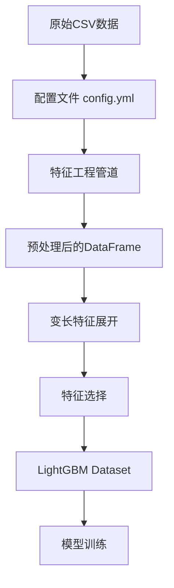

# 树模型特征处理工程实现深度分析

## 🎯 项目总体架构

这个项目采用了**配置驱动的特征工程管道**设计，将数据预处理与模型训练完全解耦，实现了高度灵活的特征处理流程。

## 📊 数据流转完整流程



## 🔧 核心组件分析

### **1. 配置驱动的管道系统**

```python
# config.yml 中的特征定义
features:
  process:
    pipelines:
      - feat_name: country_hash
        feat_type: sparse
        vocabulary_size: 200
        embedding_dim: 8
        operations:
          - col_in: country
            col_out: country
            func_name: fillna
            func_parameters:
              na_value: "null"
          - col_in: country
            col_out: country_hash
            func_name: str_hash
            func_parameters:
              vocabulary_size: 200
```

**设计优势：**
- ✅ **配置与代码分离**：特征工程逻辑完全由配置文件驱动
- ✅ **操作链式组合**：每个特征可以定义多个连续操作
- ✅ **类型化管理**：支持sparse、varlen_sparse、dense三种特征类型

### **2. 操作函数映射系统 (OP_HUB)**

```python
# src/preprocess/operations.py
OP_HUB: Dict[str, Callable] = {
    "fillna": fillna,           # 缺失值填充
    "str_hash": str_hash,       # 字符串哈希
    "list_hash": list_hash,     # 列表哈希
    "padding": padding,         # 序列填充/截断
    "split": split,             # 字符串分割
    "seperation": seperation,   # 列表元素分割
    "map_to_int": map_to_int,   # 映射到整数
    "json_to_list": json_to_list, # JSON解析
    # ... 更多操作
}
```

**核心特征：**
- 🎯 **函数注册机制**：所有操作函数统一注册到OP_HUB
- 🎯 **参数化调用**：使用partial函数实现参数绑定
- 🎯 **类型灵活性**：支持单列和多列输入

### **3. 特征处理执行器**

```python
def run_one_op_pd(x, op):
    """对DataFrame执行单个操作"""
    col_in = op.col_in
    col_out = op.col_out
    func_name = op.func_name
    parameters = op.func_parameters if op.func_parameters else dict()

    # 使用partial函数创建参数化的函数
    partial_func = partial(OP_HUB[func_name], **parameters)

    # 支持多列输入和单列输入
    if isinstance(col_in, list):
        x[col_out] = x[col_in].apply(lambda row: partial_func(*row), axis=1)
    else:
        x[col_out] = x[col_in].apply(partial_func)

    return x
```

**技术亮点：**
- 🚀 **动态函数调用**：根据配置动态选择操作函数
- 🚀 **参数绑定**：使用functools.partial预绑定参数
- 🚀 **多输入支持**：自动处理单列和多列输入场景

## 🎨 关键特征处理示例

### **1. 稀疏特征处理**

```python
# 示例：country特征处理
# 原始数据: "Germany" -> 哈希化 -> 156

# 配置：
operations:
  - col_in: country
    col_out: country
    func_name: fillna
    func_parameters:
      na_value: "null"           # 缺失值填充
  - col_in: country
    col_out: country_hash
    func_name: str_hash
    func_parameters:
      vocabulary_size: 200       # 哈希到0-199范围

# 实现：
def str_hash(x: str, vocabulary_size: int) -> int:
    """计算字符串哈希值并映射到指定范围"""
    hash_value = int(md5(x.encode('utf-8')).hexdigest(), 16)
    return hash_value % vocabulary_size
```

### **2. 变长稀疏特征处理**

```python
# 示例：用户观察股票代码处理
# 原始数据: "CLRO_186 & ETRN_169 & GOOGL_185"
# 处理结果: [456, 789, 234, 0, 0] (padding到长度5)

operations:
  - col_in: watchlists
    col_out: watchlists
    func_name: split
    func_parameters:
      sep: " & "               # 分割字符串
  - col_in: watchlists
    col_out: watchlists
    func_name: padding
    func_parameters:
      max_len: 5
      pad_value: "null"        # 填充到固定长度
  - col_in: watchlists
    col_out: user_watch_stk_code_hash
    func_name: list_hash
    func_parameters:
      vocabulary_size: 10000   # 哈希化列表

# 实现：
def list_hash(x: List[str], vocabulary_size: int) -> List[int]:
    """对列表中每个字符串进行哈希"""
    return [str_hash(item, vocabulary_size) for item in x]
```

### **3. JSON特征提取**

```python
# 示例：item_code JSON解析
# 原始数据: '[{"market":"185","code":"META","name":"Meta"}]'
# 处理结果: ["META", "null", "null", "null", "null"]

operations:
  - col_in: item_code
    col_out: item_code
    func_name: json_object_to_list
    func_parameters:
      key: "code"             # 提取JSON中的code字段
  - col_in: item_code
    col_out: item_code
    func_name: padding
    func_parameters:
      max_len: 5
      pad_value: "null"

# 实现：
def json_object_to_list(x: str, key: str, fail_value: str = "null") -> List[Any]:
    """从JSON数组中提取指定字段"""
    try:
        json_obj = json.loads(x)
        return [item.get(key, fail_value) for item in json_obj]
    except (json.JSONDecodeError, TypeError, AttributeError):
        return [fail_value]
```

## 🎯 树模型数据准备流程

### **1. 主要数据处理类 - PushClassifier**

```python
class PushClassifier:
    def _data_preprocess(self, x: pd.DataFrame) -> pd.DataFrame:
        """特征工程主流程"""
        # 1. 处理常规特征 + 交互特征
        pipelines = (
            self.cfg.features.process.pipelines +      # 基础特征
            self.cfg.features.interactions.pipelines   # 交互特征
        )
        
        # 2. 执行所有操作
        for pipe in pipelines:
            for op in pipe.operations:
                try:
                    x = run_one_op_pd(x, op)
                except Exception as e:
                    logger.debug(f"处理 {op.col_in} 时出错: {e}")
                    raise e
        
        # 3. 处理标签
        for pipe in self.cfg.features.label_process.pipelines:
            for op in pipe.operations:
                x = run_one_op_pd(x, op)
        
        # 4. 选择最终特征列
        out_columns = (
            self.cfg.features.feat_names + 
            self.cfg.datasets.trainset.label_columns
        )
        return x[out_columns]
```

### **2. 变长特征展开机制**

```python
def _feat_selection(self, x: pd.DataFrame, max_col_num: int) -> pd.DataFrame:
    """变长特征展开为多列"""
    names_set = set(self.cfg.features.feat_names)

    for feat_name in self.cfg.features.varlen_sparse_feat_names:
        # 将列表特征展开为多列
        x_explode = x[feat_name].apply(pd.Series)
        
        # 生成新的列名
        out_names = [feat_name + f"_{i}" for i in range(x_explode.columns.stop)][:max_col_num]
        
        # 选择有效列
        in_columns = [i for i in range(x_explode.columns.stop)][:max_col_num]
        
        # 添加到DataFrame
        x[out_names] = pd.DataFrame(x_explode[in_columns], index=x.index)
        
        # 更新特征名集合
        names_set.remove(feat_name)
        names_set = names_set.union(set(out_names))
    
    return x[list(names_set)]
```

**关键点：**
- 🎯 **动态列生成**：`user_watch_stk_code_hash` → `user_watch_stk_code_hash_0`, `user_watch_stk_code_hash_1`, ...
- 🎯 **长度控制**：通过`max_col_num`限制展开的列数
- 🎯 **索引对齐**：确保新列与原DataFrame索引一致

### **3. LightGBM数据转换**

```python
def train(self):
    """模型训练流程"""
    # 1. 数据准备
    X, Y = self._prepare_input(self.cfg.datasets.trainset)
    
    # 2. 数据分割
    X_train, X_val, y_train, y_val = train_test_split(
        X.values, Y.values[:, 0], test_size=0.2, random_state=42
    )
    
    # 3. 转换为LightGBM格式
    train_data = lgb.Dataset(X_train, label=y_train)
    val_data = lgb.Dataset(X_val, label=y_val)
    
    # 4. 模型训练
    model = lgb.train(
        self.model_config.model_dump(),    # 训练参数
        train_data,
        valid_sets=[train_data, val_data],
        valid_names=['train', 'valid'],
        feature_name=list(X.columns),      # 特征名传递
    )
```

**数据转换要点：**
- 📊 **值提取**：使用`.values`提取numpy数组
- 📊 **标签处理**：`Y.values[:, 0]`提取第一列作为标签
- 📊 **特征名保留**：`feature_name=list(X.columns)`保持可解释性

## 🔄 与深度模型的对比

### **数据流对比**

| 步骤 | 树模型 | 深度模型 |
|------|--------|----------|
| **特征工程** | 配置驱动的操作链 | 同样的配置驱动 |
| **哈希化** | ✅ 直接哈希为整数 | ✅ 同样哈希为整数 |
| **变长处理** | 展开为多列 | Embedding + Pooling |
| **数据格式** | `lgb.Dataset(X.values)` | `tf.data.Dataset` |
| **输入形式** | 2D numpy数组 | 字典格式多输入 |

### **关键差异**

**树模型处理方式：**
```python
# 变长特征展开
user_watch_stk_code_hash = [456, 789, 0, 0, 0]
# ↓ 展开为
user_watch_stk_code_hash_0 = 456
user_watch_stk_code_hash_1 = 789  
user_watch_stk_code_hash_2 = 0
user_watch_stk_code_hash_3 = 0
user_watch_stk_code_hash_4 = 0
# ↓ 输入LightGBM
X = [[156, 456, 789, 0, 0, 0, ...]]  # 扁平化的2D数组
```

**深度模型处理方式：**
```python
# 保持结构化输入
inputs = {
    'country_hash': [156],
    'user_watch_stk_code_hash': [[456, 789, 0, 0, 0]]
}
# ↓ Embedding层处理
embedded = {
    'country_hash': embedding_layer_1([156]),           # [8维向量]
    'user_watch_stk_code_hash': pooling(embedding_layer_2([[456, 789, 0, 0, 0]]))  # [8维向量]
}
```

## 📈 工程实现优势

### **1. 配置化优势**
```yaml
# 添加新特征只需修改配置文件
- feat_name: new_feature
  feat_type: sparse
  vocabulary_size: 1000
  operations:
    - col_in: raw_column
      col_out: new_feature_hash
      func_name: str_hash
      func_parameters:
        vocabulary_size: 1000
```

### **2. 操作复用性**
```python
# 同一个哈希函数可用于所有字符串特征
def str_hash(x: str, vocabulary_size: int) -> int:
    hash_value = int(md5(x.encode('utf-8')).hexdigest(), 16)
    return hash_value % vocabulary_size

# 配置中复用
str_hash: {vocabulary_size: 200}  # country
str_hash: {vocabulary_size: 8}    # push_title  
str_hash: {vocabulary_size: 10}   # submit_type
```

### **3. 调试友好性**
```python
# 每步操作都有明确的输入输出列
logger.debug(f"input: {x[op.col_in]}. op: {op.col_in}. got error {e}")

# 特征重要性分析
feature_importance_df = pd.DataFrame({
    'Feature': feature_names,
    'Importance': importance
})
```

## 🚀 可学习的设计模式

### **1. 配置驱动的管道模式**
```python
# 核心思想：将复杂的数据处理逻辑抽象为配置
for pipe in pipelines:
    for op in pipe.operations:
        x = run_one_op_pd(x, op)
```

### **2. 函数注册机制**
```python
# 核心思想：通过字典映射实现函数的动态调用
OP_HUB = {"fillna": fillna, "str_hash": str_hash, ...}
partial_func = partial(OP_HUB[func_name], **parameters)
```

### **3. 类型化特征管理**
```python
# 核心思想：为不同类型的特征提供统一的处理接口
if p.feat_type == "sparse":
    sparse_feat_names.append(p.feat_name)
elif p.feat_type == "varlen_sparse":
    self.varlen_sparse_feat_names.append(p.feat_name)
```

## 📝 总结

**这个树模型实现的核心价值：**

✅ **配置驱动**：特征工程完全配置化，无需修改代码
✅ **操作解耦**：每个操作函数独立可测试
✅ **类型统一**：为树模型和深度模型提供统一的特征处理
✅ **扩展性强**：添加新操作只需注册到OP_HUB
✅ **调试友好**：完整的日志和错误处理

**与我们UniProcess的关联：**
- 🔄 **相同的哈希操作**：都使用str_hash、list_hash
- 🔄 **相同的配置格式**：操作链、参数化、类型定义
- 🔄 **统一的输出格式**：都产生整数类型的特征
- 🔄 **兼容的设计理念**：配置驱动、操作组合、类型管理

**这为我们提供了完美的参考模板！** 