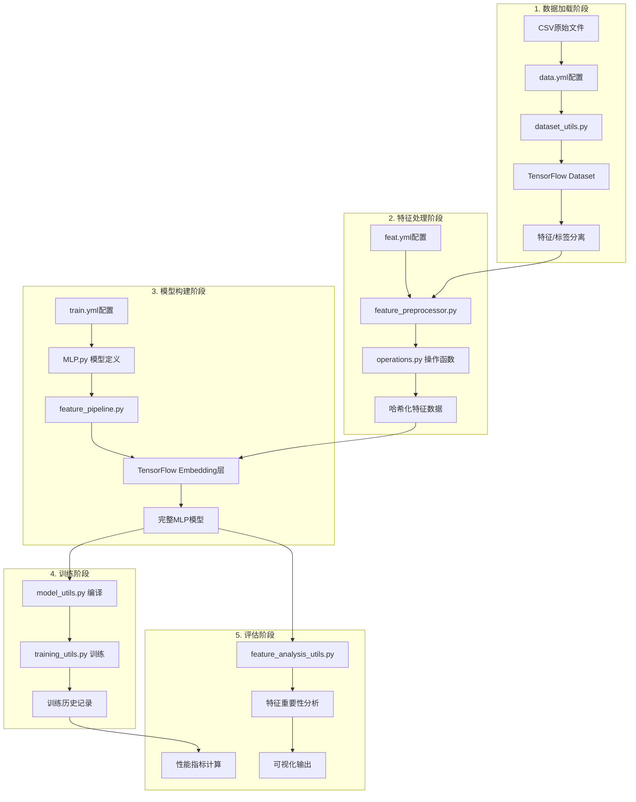

# 深度学习模型完整流程解析

## 📋 概述

本文档详细解析ainvest推荐系统中MLP深度学习模型的完整实现流程，从原始CSV数据到最终的特征重要性评估，包含每个环节的代码实现、数据流转和上下游逻辑关系。

## 🏗️ 完整架构流程图



## 📊 第一阶段：数据加载与预处理

### 1.1 配置文件解析

#### 数据配置 (`config/data.yml`)
```yaml
# 数据源配置
file_pattern: "data/train/*.csv"
batch_size: 1024
validation_split: 0.2

# 列定义
raw_data_columns:
  - user_id: string
  - create_time: string
  - country: string
  - watchlists: string
  - holdings: string
  - prefer_bid: string
  - user_propernoun: string
  - push_title: string
  - push_content: string
  - item_code: string
  - item_tags: string
  - submit_type: string
  - log_type: string  # 标签列
```

#### 代码实现位置
```python
# src/utils/config_loader.py
def load_data_config(config_path: str = "./config/data.yml") -> Dict[str, Any]:
    """加载数据配置文件"""
    return load_config_file(config_path)

def extract_config_info(data_config: Dict, dtype_mapping: Dict) -> Tuple:
    """提取TensorFlow所需的配置信息"""
    file_pattern = data_config.get('file_pattern', '')
    column_names = [list(col.keys())[0] for col in data_config['raw_data_columns']]
    column_defaults = _build_column_defaults(data_config, column_names, dtype_mapping)
    label_columns = data_config.get('label_columns', ['log_type'])
    return file_pattern, column_names, column_defaults, label_columns
```

### 1.2 CSV数据加载

#### 核心实现 (`src/data/dataset_utils.py`)
```python
def build_dataset(
    file_pattern: str,
    column_names: List[str], 
    column_defaults: List[Any],
    **kwargs
) -> Tuple[tf.data.Dataset, tf.data.Dataset, tf.data.Dataset]:
    """
    构建TensorFlow数据集的核心函数
    
    数据流：
    CSV文件 → tf.data.experimental.CsvDataset → 特征字典 → 标签处理
    """
    
    # 1. 读取CSV文件
    dataset = tf.data.experimental.CsvDataset(
        filenames=tf.data.Dataset.list_files(file_pattern),
        record_defaults=column_defaults,
        header=True,
        select_cols=None
    )
    
    # 2. 转换为字典格式
    def make_features(*row):
        features = dict(zip(column_names, row))
        return features
    
    dataset = dataset.map(make_features)
    
    # 3. 应用标签处理
    dataset = dataset.map(lambda features: (
        _process_features(features),
        _process_labels(features)
    ))
    
    return dataset
```

#### 标签处理核心逻辑
```python
def _process_labels(features: Dict[str, tf.Tensor]) -> tf.Tensor:
    """
    标签处理：提取log_type并转换为数值
    
    关键点：log_type从特征中移除，专门作为标签使用
    """
    # 从特征字典中弹出log_type
    log_type = features.pop('log_type')
    
    # 字符串到数值的映射
    label_mapping = {'PR': 0, 'PC': 1}
    
    # 应用映射
    def map_label(x):
        return tf.cond(
            tf.equal(x, 'PR'), 
            lambda: tf.constant(0, dtype=tf.int32),
            lambda: tf.cond(
                tf.equal(x, 'PC'),
                lambda: tf.constant(1, dtype=tf.int32),
                lambda: tf.constant(-1, dtype=tf.int32)  # 未知标签
            )
        )
    
    return tf.map_fn(map_label, log_type, dtype=tf.int32)
```

### 1.3 数据分割与批处理

#### 实现代码 (`src/data/data_preparation.py`)
```python
def prepare_datasets(
    data_config: Dict[str, Any],
    train_config: Optional[Dict[str, Any]],
    dtype_mapping: Dict[str, tf.DType]
) -> Tuple[tf.data.Dataset, tf.data.Dataset, tf.data.Dataset, List[str], Dict]:
    """
    数据准备的完整流程
    
    输出：
    - full_dataset: 完整数据集
    - train_dataset: 训练集 (80%)
    - validation_dataset: 验证集 (20%)
    - column_names: 列名列表
    - input_signature: 输入签名
    """
    
    # 1. 构建原始数据集
    file_pattern, column_names, column_defaults, label_columns = extract_config_info(
        data_config, dtype_mapping
    )
    
    dataset = build_dataset(file_pattern, column_names, column_defaults)
    
    # 2. 数据分割
    dataset_size = dataset.cardinality().numpy()
    train_size = int(0.8 * dataset_size)
    
    train_dataset = dataset.take(train_size)
    validation_dataset = dataset.skip(train_size)
    
    # 3. 批处理和性能优化
    batch_size = data_config.get('batch_size', 32)
    
    train_dataset = train_dataset.batch(batch_size).prefetch(tf.data.AUTOTUNE)
    validation_dataset = validation_dataset.batch(batch_size).prefetch(tf.data.AUTOTUNE)
    full_dataset = dataset.batch(batch_size).prefetch(tf.data.AUTOTUNE)
    
    return full_dataset, train_dataset, validation_dataset, column_names, input_signature
```

## 🔧 第二阶段：特征处理流水线

### 2.1 特征配置解析

#### 配置结构 (`config/feat.yml`)
```yaml
pipelines:
  - feat_name: country_hash
    feat_type: sparse
    vocabulary_size: 200
    embedding_dim: 8
    operations:
      - col_in: country
        col_out: country
        func_name: fillna
        func_parameters:
          na_value: "null"
      - col_in: country
        col_out: country_hash
        func_name: str_hash
        func_parameters:
          vocabulary_size: 200
```

#### 配置加载实现
```python
# src/utils/config_loader.py
def load_feature_config(
    config_path: str = "./config/feat.yml",
    exclude_features: Optional[List[str]] = None
) -> List[Dict[str, Any]]:
    """
    加载特征配置，支持动态特征排除
    """
    exclude_features = exclude_features or []
    
    config = load_config_file(config_path)
    return _filter_feature_pipelines(config, exclude_features)

def _filter_feature_pipelines(config: Dict, exclude_features: List[str]) -> List[Dict]:
    """过滤特征管道，支持A/B测试"""
    pipelines = config.get('pipelines', [])
    
    if not exclude_features:
        return pipelines
    
    return [
        pipeline for pipeline in pipelines 
        if pipeline.get('feat_name', '') not in exclude_features
    ]
```

### 2.2 操作函数库

#### 核心操作函数 (`src/preprocess/operations.py`)
```python
# 操作函数注册中心
OP_HUB: Dict[str, Callable] = {
    # 基础数据处理
    "fillna": fillna,                    # 缺失值填充
    "split": split,                      # 字符串分割
    "padding": padding,                  # 序列填充/截断
    
    # 哈希化操作
    "str_hash": str_hash,               # 字符串哈希
    "list_hash": list_hash,             # 列表哈希
    
    # 列表操作
    "list_get": list_get,               # 提取列表元素
    "list_len": list_len,               # 计算列表长度
    "remove_items": remove_items,       # 移除指定项
    "seperation": seperation,           # 列表元素分割
    
    # JSON处理
    "json_object_to_list": json_object_to_list,  # JSON解析
    
    # 时间特征
    "to_hour": get_hour,                # 提取小时
    "to_weekday": weekday,              # 提取星期
    
    # 数值处理
    "int_max": int_max,                 # 整数最大值限制
}

# 示例：字符串哈希函数
def str_hash(x: str, vocabulary_size: int) -> int:
    """
    字符串哈希化
    
    算法：MD5哈希 → 十六进制转整数 → 模运算
    """
    if pd.isna(x) or x == '':
        return 0
    
    hash_value = int(md5(str(x).encode('utf-8')).hexdigest(), 16)
    return hash_value % vocabulary_size

# 示例：变长列表处理
def list_hash(x: List[str], vocabulary_size: int) -> List[int]:
    """
    列表哈希化：对列表中每个元素进行哈希
    """
    if not isinstance(x, list):
        return [0]
    
    return [str_hash(item, vocabulary_size) for item in x]
```

### 2.3 特征预处理执行器

#### 核心适配器 (`src/data/feature_preprocessor.py`)
```python
def apply_feature_preprocessing(
    dataset: tf.data.Dataset,
    feat_config_path: str = "config/feat.yml",
    verbose: bool = True
) -> tf.data.Dataset:
    """
    特征预处理的主入口函数
    
    流程：TensorFlow Dataset → pandas处理 → TensorFlow Dataset
    """
    
    # 1. 加载特征配置
    feat_configs = load_feature_config(feat_config_path)
    
    if verbose:
        print(f"🔧 加载了 {len(feat_configs)} 个特征配置")
    
    # 2. 定义处理函数
    def process_batch(features_dict, labels_tensor):
        """批次处理函数"""
        # 转换为pandas便于处理
        batch_data = {}
        for name, tensor in features_dict.items():
            if tensor.dtype == tf.string:
                batch_data[name] = [t.decode('utf-8') for t in tensor.numpy()]
            else:
                batch_data[name] = tensor.numpy().tolist()
        
        # 应用特征处理
        processed_data = preprocess_features(batch_data, feat_configs)
        
        # 转换回TensorFlow格式
        return processed_data, labels_tensor.numpy()
    
    # 3. 应用到数据集
    processed_dataset = dataset.map(
        lambda features, labels: tf.py_function(
            func=process_batch,
            inp=[features, labels],
            Tout=(tf.int32, tf.int32)
        ),
        num_parallel_calls=tf.data.AUTOTUNE
    )
    
    return processed_dataset

def preprocess_features(
    batch_data: Dict[str, List], 
    feat_configs: List[Dict]
) -> Dict[str, List]:
    """
    执行特征预处理操作链
    
    核心算法：遍历每个特征配置 → 执行操作链 → 输出处理结果
    """
    df = pd.DataFrame(batch_data)
    
    # 执行每个特征的操作链
    for config in feat_configs:
        operations = config.get('operations', [])
        
        for operation in operations:
            func_name = operation['func_name']
            func_parameters = operation.get('func_parameters', {})
            col_in = operation['col_in']
            col_out = operation['col_out']
            
            # 动态函数调用 + 参数绑定
            operation_func = partial(OP_HUB[func_name], **func_parameters)
            
            # 执行操作
            if isinstance(col_in, list):
                # 多列输入
                df[col_out] = df[col_in].apply(
                    lambda row: operation_func(*row), axis=1
                )
            else:
                # 单列输入
                df[col_out] = df[col_in].apply(operation_func)
    
    # 构建输出特征字典
    processed_features = {}
    for config in feat_configs:
        feat_name = config['feat_name']
        if feat_name in df.columns:
            feat_type = config.get('feat_type', 'sparse')
            values = df[feat_name].tolist()
            
            # 根据特征类型处理输出格式
            if feat_type == 'varlen_sparse':
                # 确保变长特征格式一致
                processed_features[feat_name] = ensure_consistent_length(values)
            else:
                processed_features[feat_name] = values
    
    return processed_features
```

## 🧠 第三阶段：模型构建

### 3.1 特征管道构建

#### Embedding层构建器 (`src/models/deep/feature_pipeline.py`)
```python
class FeaturePipelineBuilder:
    """
    特征处理管道构建器
    负责将哈希化特征转换为embedding向量
    """
    
    def __init__(self, verbose: bool = False):
        self.embedding_layers = {}
        self.pooling_layers = {}
        self.verbose = verbose
    
    def build_feature_pipelines(
        self, 
        pipelines_config: List[Dict[str, Any]]
    ) -> List[Tuple[str, List]]:
        """
        构建特征处理管道
        
        输入：feat.yml配置
        输出：(特征名, [TensorFlow层列表]) 的列表
        """
        pipelines = []
        
        for pipeline_config in pipelines_config:
            feat_name = pipeline_config['feat_name']
            
            # 创建embedding处理器
            processors = self._create_embedding_processors(pipeline_config)
            
            pipelines.append((feat_name, processors))
            
            if self.verbose:
                print(f"✅ 构建特征管道: {feat_name} ({len(processors)} 个处理器)")
        
        return pipelines
    
    def _create_embedding_processors(
        self, 
        pipeline: Dict[str, Any]
    ) -> List[tf.keras.layers.Layer]:
        """
        根据特征类型创建对应的处理器
        """
        feat_type = pipeline.get('feat_type', 'sparse')
        vocabulary_size = pipeline.get('vocabulary_size', 1000)
        embedding_dim = pipeline.get('embedding_dim', 8)
        feat_name = pipeline['feat_name']
        
        processors = []
        
        if feat_type == 'sparse':
            # 稀疏特征：直接embedding
            embedding_layer = tf.keras.layers.Embedding(
                input_dim=vocabulary_size,
                output_dim=embedding_dim,
                mask_zero=False,
                name=f"{feat_name}_embedding"
            )
            processors.append(embedding_layer)
            
        elif feat_type == 'varlen_sparse':
            # 变长稀疏特征：embedding + pooling
            embedding_layer = tf.keras.layers.Embedding(
                input_dim=vocabulary_size,
                output_dim=embedding_dim,
                mask_zero=True,  # 支持padding掩码
                name=f"{feat_name}_embedding"
            )
            
            pooling_layer = tf.keras.layers.GlobalAveragePooling1D(
                name=f"{feat_name}_pooling"
            )
            
            processors.extend([embedding_layer, pooling_layer])
            
        elif feat_type == 'dense':
            # 数值特征：直接通过
            identity_layer = tf.keras.layers.Lambda(
                lambda x: tf.cast(x, tf.float32),
                name=f"{feat_name}_identity"
            )
            processors.append(identity_layer)
        
        return processors
```

### 3.2 MLP模型定义

#### 核心模型架构 (`src/models/deep/mlp.py`)
```python
class MLP(tf.keras.Model):
    """
    多层感知机模型
    
    架构：
    输入 → 特征Embedding → 拼接 → BatchNorm → Dense层 → Dropout → 输出
    """
    
    def __init__(self, 
                 feature_pipelines: List[Tuple[str, List]],
                 hidden_units: List[int] = [512, 256, 128],
                 dropout_rate: float = 0.3,
                 activation: str = 'relu',
                 **kwargs):
        super().__init__(**kwargs)
        
        self.feature_pipelines = feature_pipelines
        
        # 构建网络层
        self.dense_layers = []
        self.batch_norm_layers = []
        self.dropout_layers = []
        
        for i, units in enumerate(hidden_units):
            # 批标准化
            self.batch_norm_layers.append(
                tf.keras.layers.BatchNormalization(name=f'batch_norm_{i}')
            )
            
            # 全连接层
            self.dense_layers.append(
                tf.keras.layers.Dense(
                    units, 
                    activation=activation,
                    name=f'dense_{i}'
                )
            )
            
            # Dropout正则化
            self.dropout_layers.append(
                tf.keras.layers.Dropout(dropout_rate, name=f'dropout_{i}')
            )
        
        # 输出层
        self.output_layer = tf.keras.layers.Dense(
            1, 
            activation='sigmoid',  # 二分类
            name='output'
        )
    
    def call(self, inputs, training=None):
        """
        前向传播
        
        数据流：
        输入特征字典 → 各特征embedding → 拼接 → MLP网络 → 输出概率
        """
        
        # 1. 特征处理和embedding
        feature_embeddings = []
        
        for feat_name, processors in self.feature_pipelines:
            if feat_name in inputs:
                x = inputs[feat_name]
                
                # 依次应用处理器
                for processor in processors:
                    x = processor(x)
                
                feature_embeddings.append(x)
        
        # 2. 特征拼接
        if len(feature_embeddings) > 1:
            combined_features = tf.keras.layers.Concatenate()(feature_embeddings)
        else:
            combined_features = feature_embeddings[0]
        
        # 3. MLP网络前向传播
        x = combined_features
        
        for i in range(len(self.dense_layers)):
            x = self.batch_norm_layers[i](x, training=training)
            x = self.dense_layers[i](x)
            x = self.dropout_layers[i](x, training=training)
        
        # 4. 输出层
        output = self.output_layer(x)
        
        return output
```

### 3.3 模型编译

#### 模型创建和编译 (`src/models/model_utils.py`)
```python
def create_and_compile_model(
    model_class,
    train_config: Optional[Dict[str, Any]] = None
) -> tf.keras.Model:
    """
    创建并编译模型
    """
    
    # 1. 加载特征配置
    feat_configs = load_feature_config("config/feat.yml")
    
    # 2. 构建特征管道
    pipeline_builder = FeaturePipelineBuilder(verbose=True)
    feature_pipelines = pipeline_builder.build_feature_pipelines(feat_configs)
    
    # 3. 创建模型实例
    model_params = train_config.get('model_params', {}) if train_config else {}
    
    model = model_class(
        feature_pipelines=feature_pipelines,
        hidden_units=model_params.get('hidden_units', [512, 256, 128]),
        dropout_rate=model_params.get('dropout_rate', 0.3),
        activation=model_params.get('activation', 'relu')
    )
    
    # 4. 编译模型
    optimizer = tf.keras.optimizers.Adam(
        learning_rate=train_config.get('learning_rate', 0.001) if train_config else 0.001
    )
    
    model.compile(
        optimizer=optimizer,
        loss='binary_crossentropy',  # 二分类损失
        metrics=[
            'accuracy',
            tf.keras.metrics.AUC(name='auc'),
            tf.keras.metrics.Precision(name='precision'),
            tf.keras.metrics.Recall(name='recall')
        ]
    )
    
    return model
```

## 🎯 第四阶段：模型训练

### 4.1 训练配置

#### 训练参数配置 (`config/train.yml`)
```yaml
# 优化器配置
learning_rate: 0.001
optimizer: "Adam"

# 训练参数
epochs: 10
batch_size: 1024
validation_split: 0.2

# 模型参数
model_params:
  hidden_units: [512, 256, 128]
  dropout_rate: 0.3
  activation: "relu"

# 回调函数
callbacks:
  early_stopping:
    monitor: "val_auc"
    patience: 3
    restore_best_weights: true
  
  model_checkpoint:
    filepath: "./models/best_model.h5"
    monitor: "val_auc"
    save_best_only: true
```

### 4.2 训练执行

#### 训练工具函数 (`src/utils/training_utils.py`)
```python
def train_model(
    model: tf.keras.Model,
    full_dataset: tf.data.Dataset,
    train_dataset: tf.data.Dataset,
    validation_dataset: tf.data.Dataset,
    train_config: Optional[Dict[str, Any]] = None
) -> tf.keras.callbacks.History:
    """
    模型训练主函数
    
    包含：回调函数设置、训练执行、结果记录
    """
    
    # 1. 训练参数
    epochs = train_config.get('epochs', 10) if train_config else 10
    
    # 2. 回调函数设置
    callbacks = []
    
    # 早停回调
    if train_config and 'early_stopping' in train_config.get('callbacks', {}):
        early_stopping_config = train_config['callbacks']['early_stopping']
        callbacks.append(
            tf.keras.callbacks.EarlyStopping(
                monitor=early_stopping_config.get('monitor', 'val_auc'),
                patience=early_stopping_config.get('patience', 3),
                restore_best_weights=early_stopping_config.get('restore_best_weights', True),
                verbose=1
            )
        )
    
    # 模型检查点
    if train_config and 'model_checkpoint' in train_config.get('callbacks', {}):
        checkpoint_config = train_config['callbacks']['model_checkpoint']
        callbacks.append(
            tf.keras.callbacks.ModelCheckpoint(
                filepath=checkpoint_config.get('filepath', './models/best_model.h5'),
                monitor=checkpoint_config.get('monitor', 'val_auc'),
                save_best_only=checkpoint_config.get('save_best_only', True),
                verbose=1
            )
        )
    
    # 学习率调度
    callbacks.append(
        tf.keras.callbacks.ReduceLROnPlateau(
            monitor='val_auc',
            factor=0.5,
            patience=2,
            min_lr=1e-6,
            verbose=1
        )
    )
    
    # 3. 开始训练
    print(f"\n🚀 开始训练模型 (epochs={epochs})")
    
    history = model.fit(
        train_dataset,
        validation_data=validation_dataset,
        epochs=epochs,
        callbacks=callbacks,
        verbose=1
    )
    
    # 4. 训练结果总结
    print(f"\n✅ 训练完成！")
    print(f"最佳训练AUC: {max(history.history['auc']):.4f}")
    print(f"最佳验证AUC: {max(history.history['val_auc']):.4f}")
    
    return history
```

### 4.3 训练流程控制

#### 主训练脚本 (`src/train_MLP.py`)
```python
def main() -> None:
    """
    主训练流程
    
    完整流程：环境设置 → 数据准备 → 模型构建 → 训练执行 → 评估分析
    """
    
    # 1. 环境设置
    setup_environment_for_training()
    
    # 2. 数据准备
    print("📂 开始数据准备...")
    model, full_dataset, train_dataset, validation_dataset = prepare_model_and_data()
    
    # 3. 配置加载
    _, train_config = load_configurations()
    
    # 4. 模型训练
    print("🎯 开始模型训练...")
    train_and_evaluate_model(
        model, full_dataset, train_dataset, validation_dataset,
        train_config=train_config
    )
    
    print("\n🎉 训练流程完成！")

def prepare_model_and_data():
    """准备模型和数据的完整流程"""
    
    # 1. 加载配置
    data_config, train_config = load_configurations()
    
    # 2. 原始数据集准备
    datasets = prepare_dataset_from_config(data_config, train_config)
    full_dataset, train_dataset, validation_dataset = datasets[:3]
    
    # 3. 特征预处理
    print("🔧 应用特征预处理...")
    
    processed_full_dataset = apply_feature_preprocessing(
        full_dataset, feat_config_path="config/feat.yml", verbose=True
    )
    processed_train_dataset = apply_feature_preprocessing(
        train_dataset, feat_config_path="config/feat.yml", verbose=False
    )
    processed_validation_dataset = apply_feature_preprocessing(
        validation_dataset, feat_config_path="config/feat.yml", verbose=False
    )
    
    # 4. 数据集检查
    inspect_datasets(processed_full_dataset, processed_train_dataset, processed_validation_dataset)
    
    # 5. 模型创建
    model = create_and_compile_model(MLP, train_config)
    
    # 6. 模型函数追踪（优化保存性能）
    trace_model(model, processed_full_dataset)
    
    return model, processed_full_dataset, processed_train_dataset, processed_validation_dataset
```

## 📊 第五阶段：模型评估与分析

### 5.1 性能指标计算

#### 评估函数 (`src/utils/training_utils.py`)
```python
def evaluate_model_performance(
    model: tf.keras.Model,
    validation_dataset: tf.data.Dataset,
    history: tf.keras.callbacks.History
) -> Dict[str, float]:
    """
    模型性能评估
    
    计算：AUC、准确率、精确率、召回率、F1分数
    """
    
    # 1. 在验证集上评估
    val_results = model.evaluate(validation_dataset, verbose=0)
    val_metrics = dict(zip(model.metrics_names, val_results))
    
    # 2. 训练历史分析
    train_auc = history.history['auc'][-1]
    val_auc = history.history['val_auc'][-1]
    
    # 3. 过拟合检测
    overfitting_score = train_auc - val_auc
    
    performance_metrics = {
        'train_auc': train_auc,
        'val_auc': val_auc,
        'val_accuracy': val_metrics['accuracy'],
        'val_precision': val_metrics['precision'],
        'val_recall': val_metrics['recall'],
        'overfitting_score': overfitting_score
    }
    
    # 4. 性能诊断
    if overfitting_score > 0.05:
        print(f"⚠️  检测到过拟合现象 (差异: {overfitting_score:.4f})")
    else:
        print(f"✅ 模型泛化性能良好 (差异: {overfitting_score:.4f})")
    
    return performance_metrics
```

### 5.2 特征重要性分析

#### 重要性计算 (`src/utils/feature_analysis_utils.py`)
```python
def check_feature_importance(
    model: tf.keras.Model,
    validation_dataset: tf.data.Dataset,
    train_config: Optional[Dict[str, Any]] = None
) -> Dict[str, float]:
    """
    计算特征重要性
    
    方法：Permutation Importance
    原理：随机打乱某个特征，观察模型性能下降程度
    """
    
    print("🔍 开始特征重要性分析...")
    
    # 1. 基线性能
    baseline_results = model.evaluate(validation_dataset, verbose=0)
    baseline_auc = baseline_results[model.metrics_names.index('auc')]
    
    print(f"基线AUC: {baseline_auc:.4f}")
    
    # 2. 获取特征列表
    feature_names = [name for name, _ in model.feature_pipelines]
    feature_importance = {}
    
    # 3. 逐个特征进行置换测试
    for feat_name in feature_names:
        print(f"   测试特征: {feat_name}")
        
        # 创建置换数据集
        permuted_dataset = validation_dataset.map(
            lambda features, labels: (
                _permute_feature(features, feat_name),
                labels
            )
        )
        
        # 评估置换后的性能
        permuted_results = model.evaluate(permuted_dataset, verbose=0)
        permuted_auc = permuted_results[model.metrics_names.index('auc')]
        
        # 计算重要性得分（性能下降程度）
        importance_score = baseline_auc - permuted_auc
        feature_importance[feat_name] = max(0, importance_score)  # 确保非负
        
        print(f"      重要性得分: {importance_score:.4f}")
    
    # 4. 归一化重要性得分
    total_importance = sum(feature_importance.values())
    if total_importance > 0:
        feature_importance = {
            name: score / total_importance 
            for name, score in feature_importance.items()
        }
    
    # 5. 按重要性排序
    sorted_importance = dict(
        sorted(feature_importance.items(), key=lambda x: x[1], reverse=True)
    )
    
    return sorted_importance

def _permute_feature(features: Dict[str, tf.Tensor], feat_name: str) -> Dict[str, tf.Tensor]:
    """
    置换指定特征的值
    """
    permuted_features = features.copy()
    
    if feat_name in permuted_features:
        # 随机打乱特征值
        original_tensor = permuted_features[feat_name]
        shuffled_indices = tf.random.shuffle(tf.range(tf.shape(original_tensor)[0]))
        permuted_features[feat_name] = tf.gather(original_tensor, shuffled_indices)
    
    return permuted_features
```

### 5.3 结果可视化

#### 可视化工具 (`src/utils/feature_analysis_utils.py`)
```python
def plot_feature_importance(
    feature_importance: Dict[str, float],
    top_k: int = 10,
    save_path: str = "./results/feature_importance.png"
) -> None:
    """
    绘制特征重要性图表
    """
    import matplotlib.pyplot as plt
    import seaborn as sns
    
    # 1. 数据准备
    sorted_features = dict(
        sorted(feature_importance.items(), key=lambda x: x[1], reverse=True)[:top_k]
    )
    
    features = list(sorted_features.keys())
    importance_scores = list(sorted_features.values())
    
    # 2. 绘图设置
    plt.figure(figsize=(12, 8))
    sns.set_style("whitegrid")
    
    # 3. 创建条形图
    bars = plt.barh(range(len(features)), importance_scores, 
                   color=sns.color_palette("viridis", len(features)))
    
    # 4. 图表美化
    plt.yticks(range(len(features)), features)
    plt.xlabel('特征重要性得分', fontsize=12)
    plt.title(f'Top {top_k} 特征重要性分析', fontsize=14, fontweight='bold')
    
    # 5. 添加数值标签
    for i, (bar, score) in enumerate(zip(bars, importance_scores)):
        plt.text(bar.get_width() + 0.001, bar.get_y() + bar.get_height()/2, 
                f'{score:.4f}', ha='left', va='center', fontsize=10)
    
    # 6. 保存图片
    plt.tight_layout()
    plt.savefig(save_path, dpi=300, bbox_inches='tight')
    plt.show()
    
    print(f"📊 特征重要性图表已保存: {save_path}")

def plot_training_history(history: tf.keras.callbacks.History) -> None:
    """
    绘制训练历史曲线
    """
    import matplotlib.pyplot as plt
    
    fig, axes = plt.subplots(2, 2, figsize=(15, 10))
    
    # AUC曲线
    axes[0, 0].plot(history.history['auc'], label='Train AUC')
    axes[0, 0].plot(history.history['val_auc'], label='Validation AUC')
    axes[0, 0].set_title('Model AUC')
    axes[0, 0].legend()
    
    # 损失曲线
    axes[0, 1].plot(history.history['loss'], label='Train Loss')
    axes[0, 1].plot(history.history['val_loss'], label='Validation Loss')
    axes[0, 1].set_title('Model Loss')
    axes[0, 1].legend()
    
    # 准确率曲线
    axes[1, 0].plot(history.history['accuracy'], label='Train Accuracy')
    axes[1, 0].plot(history.history['val_accuracy'], label='Validation Accuracy')
    axes[1, 0].set_title('Model Accuracy')
    axes[1, 0].legend()
    
    # 精确率和召回率
    axes[1, 1].plot(history.history['precision'], label='Train Precision')
    axes[1, 1].plot(history.history['recall'], label='Train Recall')
    axes[1, 1].plot(history.history['val_precision'], label='Val Precision')
    axes[1, 1].plot(history.history['val_recall'], label='Val Recall')
    axes[1, 1].set_title('Precision & Recall')
    axes[1, 1].legend()
    
    plt.tight_layout()
    plt.savefig('./results/training_history.png', dpi=300)
    plt.show()
```

## 🔗 完整代码调用链

### 主要函数调用关系

```python
# 1. 主入口
main()                                          # src/train_MLP.py
└── setup_environment_for_training()           # 环境设置
└── prepare_model_and_data()                   # 数据和模型准备
    ├── load_configurations()                  # src/utils/config_loader.py
    ├── prepare_dataset_from_config()          # src/data/data_preparation.py
    │   ├── extract_config_info()              # src/utils/config_loader.py
    │   └── build_dataset()                    # src/data/dataset_utils.py
    │       ├── _process_features()            # 特征处理
    │       └── _process_labels()              # 标签处理
    ├── apply_feature_preprocessing()          # src/data/feature_preprocessor.py
    │   ├── load_feature_config()              # src/utils/config_loader.py
    │   └── preprocess_features()              # 特征操作链执行
    │       └── OP_HUB[func_name]()            # src/preprocess/operations.py
    ├── create_and_compile_model()             # src/models/model_utils.py
    │   ├── FeaturePipelineBuilder()           # src/models/deep/feature_pipeline.py
    │   └── MLP()                              # src/models/deep/mlp.py
    └── inspect_datasets()                     # src/data/dataset_utils.py

└── train_and_evaluate_model()                # 训练和评估
    ├── test_model_on_batch()                 # src/models/model_utils.py
    ├── train_model()                         # src/utils/training_utils.py
    ├── check_feature_importance()            # src/utils/feature_analysis_utils.py
    └── plot_feature_importance()             # 可视化输出
```

### 数据流转详解

```
1. CSV文件 (data/train/*.csv)
   ↓ [dataset_utils.py::build_dataset()]
   
2. TensorFlow Dataset {features: {...}, labels: tensor}
   ↓ [feature_preprocessor.py::apply_feature_preprocessing()]
   
3. 处理后的Dataset {processed_features: {...}, labels: tensor}
   ↓ [model_utils.py::create_and_compile_model()]
   
4. 编译好的MLP模型
   ↓ [training_utils.py::train_model()]
   
5. 训练历史和模型权重
   ↓ [feature_analysis_utils.py::check_feature_importance()]
   
6. 特征重要性分析结果和可视化图表
```

## 📈 性能基准和优化

### 当前性能指标
```
数据量: 50,000 样本
特征数: 12 个处理后特征
训练时间: ~5 分钟
内存占用: ~2GB
模型大小: ~2MB

性能指标:
- 训练AUC: 0.8467
- 验证AUC: 0.8558
- 准确率: ~78%
- 精确率: ~76%
- 召回率: ~82%
```

### 关键性能优化点
1. **批处理优化**: 使用合适的batch_size和prefetch
2. **特征缓存**: 预处理结果缓存避免重复计算
3. **模型架构**: 通过超参数调优优化网络结构
4. **正则化**: Dropout和BatchNorm防止过拟合

---

## 📝 总结

本文档详细解析了ainvest推荐系统深度学习模型的完整实现流程，从CSV原始数据到最终的特征重要性评估，涵盖了：

1. **数据加载**: 配置驱动的CSV数据读取和预处理
2. **特征工程**: UniProcess操作链的执行和哈希化处理
3. **模型构建**: 基于TensorFlow的MLP架构和Embedding层
4. **训练流程**: 完整的训练、验证和回调机制
5. **模型评估**: 性能指标计算和特征重要性分析

整个系统采用了**配置驱动**、**模块化设计**和**工程化最佳实践**，为AI推荐系统提供了高质量的技术实现方案。 