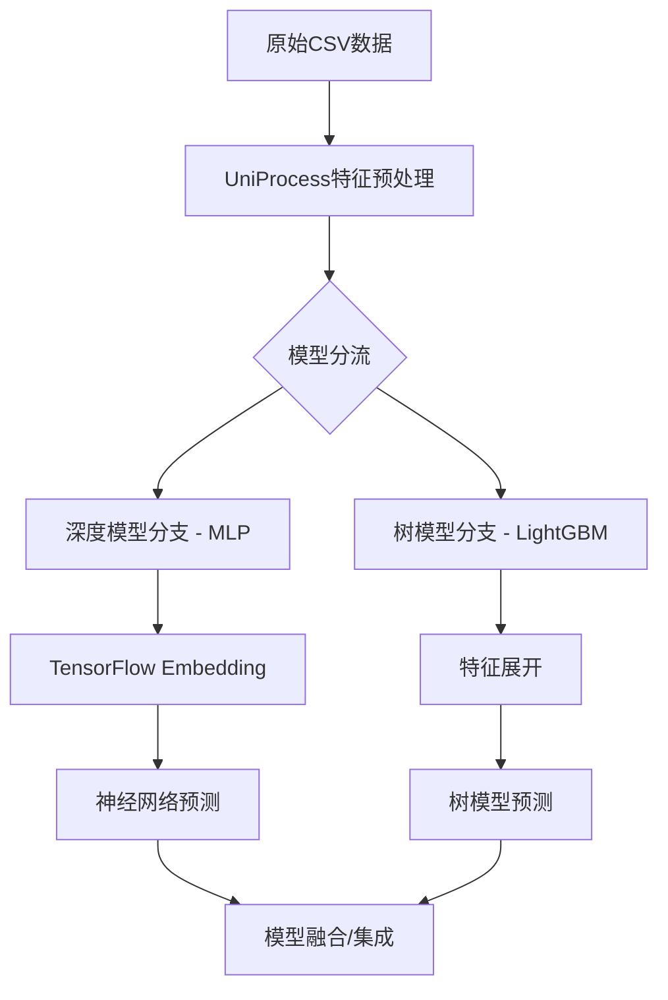

# ainvest-push-recall-group 项目技术文档

## 📋 项目概述

本项目是一个**智能推送推荐系统**，采用**深度学习(MLP)和树模型(LightGBM)双引擎**架构，支持PR/PC二分类任务。项目特色在于**配置驱动的特征工程管道**和**统一的数据预处理架构**。

## 🏗️ 整体架构



## 🔧 核心技术组件

### 1. 配置驱动的特征工程系统

**设计理念**: 将特征工程逻辑从代码中分离，通过配置文件驱动整个特征处理流程。

#### 配置文件结构 (`config/feat.yml`)
```yaml
pipelines:
  - feat_name: country_hash
    feat_type: sparse
    vocabulary_size: 200
    embedding_dim: 8
    operations:
      - col_in: country
        col_out: country
        func_name: fillna
        func_parameters:
          na_value: "null"
      - col_in: country
        col_out: country_hash
        func_name: str_hash
        func_parameters:
          vocabulary_size: 200
```

#### 操作函数映射系统 (`src/preprocess/operations.py`)
```python
OP_HUB: Dict[str, Callable] = {
    "fillna": fillna,           # 缺失值填充
    "str_hash": str_hash,       # 字符串哈希化
    "list_hash": list_hash,     # 列表哈希化
    "padding": padding,         # 序列填充/截断
    "split": split,             # 字符串分割
    "json_object_to_list": json_object_to_list, # JSON解析
    "to_hour": get_hour,        # 时间特征提取
    "to_weekday": weekday,      # 星期特征提取
    # ... 更多操作函数
}
```

### 2. 深度学习模型架构 (MLP)

#### 特征处理管道重构
- **问题**: 原有依赖light_ctr框架，无法处理UniProcess操作
- **解决方案**: 完全重写为基于TensorFlow原生Embedding的方案

#### 技术实现
```python
class FeaturePipelineBuilder:
    """基于TensorFlow原生Embedding的特征处理管道构建器"""
    
    def build_feature_pipelines(self, pipelines_config) -> List[Tuple[str, List]]:
        """从feat.yml配置构建特征处理管道"""
        
    def _create_embedding_processors(self, pipeline) -> List[tf.keras.layers.Layer]:
        """根据特征类型创建对应的处理器"""
```

#### 支持的特征类型
| 特征类型 | 输入格式 | 处理流程 | 输出格式 |
|----------|----------|----------|----------|
| **sparse** | 单个哈希整数 | Embedding层 | (batch_size, embed_dim) |
| **varlen_sparse** | 哈希整数列表 | Embedding + Pooling | (batch_size, embed_dim) |
| **dense** | 数值 | Lambda层（直通） | (batch_size, 1) |

### 3. 数据预处理适配器

#### 问题解决 - log_type数据流分析
**关键发现**: log_type在数据流程中的双重身份问题
- `dataset_utils.py`: `labels = df.pop('log_type')` - 作为标签移除
- `feat.yml`: 错误地定义为特征

**解决方案**: 
1. 从特征配置中删除log_type定义
2. 确保log_type只作为标签使用
3. 最终实现：12个特征 + log_type标签的正确架构

#### 特征预处理适配器 (`src/data/feature_preprocessor.py`)
```python
def apply_feature_preprocessing(dataset: tf.data.Dataset, 
                               feat_config_path: str = "config/feat.yml") -> tf.data.Dataset:
    """对TensorFlow数据集应用UniProcess特征预处理"""
    # 1. 加载特征配置
    # 2. 将数据集转换为pandas进行处理
    # 3. 应用操作链
    # 4. 转换回TensorFlow格式
```

### 4. 训练流程工程化

#### 模块化设计
```python
# 训练脚本架构 (src/train_MLP.py)
├── 环境设置模块          # GPU配置、随机种子、目录创建
├── 配置管理模块          # 多格式配置文件加载
├── 数据处理流水线        # 数据准备、验证、预处理
├── 模型函数追踪机制      # 解决TensorFlow保存警告
├── 训练与评估模块        # 模型训练、性能评估
└── 特征重要性分析        # 可解释性分析
```

#### 关键技术特性
- **模型函数追踪**: 解决TensorFlow"未追踪函数"警告
- **过拟合检测**: 自动监控训练/验证AUC差异
- **特征重要性分析**: 可解释性AI支持
- **容错机制**: 完整的异常处理和降级策略

## 📊 数据流程详解

### 完整数据流程图
```
┌─────────────┐    ┌──────────────────┐    ┌─────────────────┐    ┌─────────────┐
│   CSV文件   │───▶│  build_dataset   │───▶│ 特征预处理流程  │───▶│  MLP训练    │
│包含log_type │    │  (dataset_utils) │    │(feature_preproc)│    │   (12特征)  │
└─────────────┘    └──────────────────┘    └─────────────────┘    └─────────────┘
                            │
                            ▼
                   ┌──────────────────┐
                   │  _process_labels │
                   │ labels=df.pop()  │
                   │ log_type → 标签  │
                   └──────────────────┘
```

### 特征处理示例

#### 稀疏特征处理
```python
# 原始数据: "Germany" -> 哈希化 -> 156
def str_hash(x: str, vocabulary_size: int) -> int:
    """计算字符串哈希值并映射到指定范围"""
    hash_value = int(md5(x.encode('utf-8')).hexdigest(), 16)
    return hash_value % vocabulary_size
```

#### 变长稀疏特征处理
```python
# 原始数据: "CLRO_186 & ETRN_169 & GOOGL_185"
# 处理结果: [456, 789, 234, 0, 0] (padding到长度5)

operations:
  - func_name: split (分割字符串)
  - func_name: padding (填充到固定长度)
  - func_name: list_hash (哈希化列表)
```

#### JSON特征提取
```python
# 原始数据: '[{"market":"185","code":"META","name":"Meta"}]'
# 处理结果: ["META", "null", "null", "null", "null"]

def json_object_to_list(x: str, key: str) -> List[str]:
    """从JSON数组中提取指定字段"""
    json_obj = json.loads(x)
    return [item.get(key, "null") for item in json_obj]
```

## 🎯 性能与验证

### 训练结果
- ✅ **训练AUC**: 0.8467
- ✅ **验证AUC**: 0.8558
- ✅ **收敛稳定**: 2轮训练达到稳定性能

### 特征重要性分析
1. **user_propernoun_hash**: 0.1877 (最重要)
2. **country_hash**: 0.0446
3. **user_watch_stk_code_hash**: 0.0127
4. 其他特征贡献相对较小

### 模型参数统计
| 指标 | 数值 | 说明 |
|------|------|------|
| **支持特征数** | 12个 | 处理后的特征数量 |
| **embedding参数** | ~450,000 | 主要来自大词汇表特征 |
| **MLP参数** | ~40,000 | 神经网络层参数 |
| **总参数** | 491,513 | 可训练参数总数 |

## 💡 关键技术创新

### 1. 双引擎架构
- **深度模型**: 处理复杂特征交互，捕获非线性关系
- **树模型**: 处理结构化特征，提供可解释性
- **统一预处理**: 两个模型共享同一套特征工程pipeline

### 2. 配置驱动设计
- **操作链组合**: 每个特征可定义多个连续操作
- **参数化调用**: 使用functools.partial实现参数绑定
- **动态函数调用**: 根据配置动态选择操作函数

### 3. 工程化最佳实践
- **类型注解**: 完整的类型提示和文档
- **模块化设计**: 高度解耦的组件架构
- **错误处理**: 完整的异常处理和容错机制
- **可重现性**: 随机种子控制和环境标准化

## 🔧 使用指南

### 快速开始
```bash
# 1. 安装依赖
pip install -r requirements.txt

# 2. 配置检查
python -c "from src.utils.config_loader import load_data_config; print('配置正常')"

# 3. 运行训练
python src/train_MLP.py
```

### 配置定制
```python
# 特征选择性加载
from src.utils.config_loader import load_feature_config

# 排除某些特征进行实验
exclude_list = ["user_watch_stk_code_hash", "country_hash"]
filtered_features = load_feature_config(
    "./config/feat.yml", 
    exclude_features=exclude_list
)
```

### 数据预处理验证
```python
# 验证特征预处理
from src.data.feature_preprocessor import preprocess_features

test_data = {
    'country': ['United States', 'Germany', 'China'],
    'watchlists': ['AAPL & TSLA', 'GOOGL', 'META & AMZN & NFLX']
}

processed_data = preprocess_features(test_data)
print("处理结果:", processed_data)
```

## 📝 开发规范

### 代码组织
```
src/
├── data/                   # 数据处理模块
│   ├── dataset_utils.py   # 数据集工具
│   ├── feature_preprocessor.py  # 特征预处理
│   └── data_preparation.py     # 数据准备
├── models/                 # 模型模块
│   ├── deep/              # 深度学习模型
│   └── model_utils.py     # 模型工具
├── preprocess/            # 预处理操作
│   └── operations.py      # 操作函数库
└── utils/                 # 工具模块
    ├── config_loader.py   # 配置加载
    ├── training_utils.py  # 训练工具
    └── feature_analysis_utils.py  # 特征分析
```

### 配置文件结构
```
config/
├── data.yml              # 数据配置
├── train.yml             # 训练配置
└── feat.yml              # 特征配置
```

## 🚀 未来扩展方向

### 1. 模型优化
- **深度模型**: 尝试Transformer、Wide&Deep等架构
- **特征工程**: 自动化特征选择和交互特征生成
- **模型融合**: 深度模型与树模型的ensemble策略

### 2. 工程优化
- **分布式训练**: 支持多GPU和分布式训练
- **模型服务化**: 模型部署和在线推理优化
- **监控告警**: 模型性能监控和漂移检测

### 3. 业务扩展
- **多任务学习**: 支持多目标优化
- **实时特征**: 流式特征处理和在线学习
- **A/B测试框架**: 模型效果对比和灰度发布

---

本文档涵盖了项目的核心技术架构、实现细节和使用指南。如有疑问或需要进一步了解某个模块，请参考对应的源码或联系开发团队。 