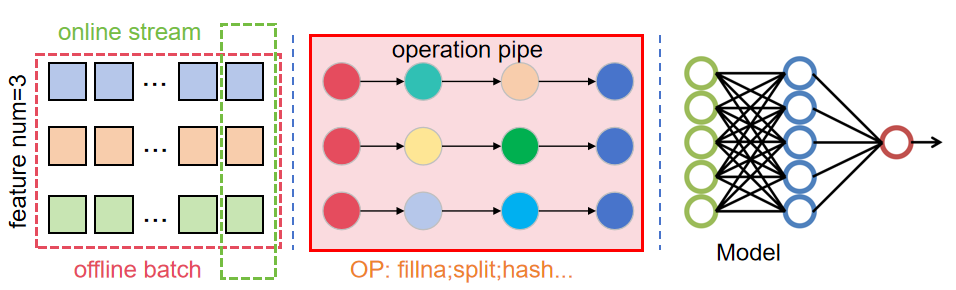

# Unity Process

统一线上线下的预处理。



1. 算子：最小的处理函数，如填充、拆分、哈希等。
2. 数据管道：输入单列或多列数据，通过一系列算子输出单个特征。
3. 配置文件：所以算子的名称、参数以及算子组合通过YAML配置文件定义。

不管是离线训练还是线上推理，通过相同的配置文件与算子实现，保证预处理过程的一致性。

## 一、算子

所有的算子的实现均在`uniprocess/operations`下。

具体算子见[算子介绍](uniprocess/operations/README.md)

## 二、配置文件

数据预处理的配置是一个YAML文件。具体的配置见[配置模板说明](templates/README.md)。

## 三、安装

### 3.1 Pip安装

本框架已经通过Pack平台发布，可以直接通过pip安装。

```sh
pip install rec-preprocess # 建议指定包版本
```

注意：AI平台容器内可以直接安装，本地环境可能需要配置host。

## 3.3 源码安装（可选）

1. 下载源码

```sh
git clone http://gitlab.myhexin.com/10jqka/iwencai/aie61/recsys_algorithm/UniProcess.git
git checkout dev_tiny
pip install pyyaml
```

2. 源码打包

终端执行`poetry build`命令，在当前目录会产生`dist`目录，包含`.whl`和`.tar.gz`文件。

3. Pip安装

通过执行`pip install dist/rec_preprocess-xxx.whl` 可以将构建的包安装至本地环境。


Nuitka编译加速
---

源码安装一般建议仅在本地训练时使用，并且可以通过下方的编译加速，提升处理速度。


```sh
pip install nuitka
cd uniprocess
python -m nuitka --module operations --include-package=operations
```

## 四、开发

### 4.1 代码修改

1. 修改`uniprocess/operations`下的算子；
2. 算子测试可用后，在`uniprocess/operations/__init__.py`中引入；
3. 在`uniprocess/operations/README.md`中更新相关文档。

### 4.2 发布

如果是重要的修改，建议将代码提交后，及时通过Pack平台对源码进行打包发布。

Pack平台：<http://pack.cloud.myhexin.com/10jqka-iwencai-aie61-recsys_algorithm/UniProcess/>
